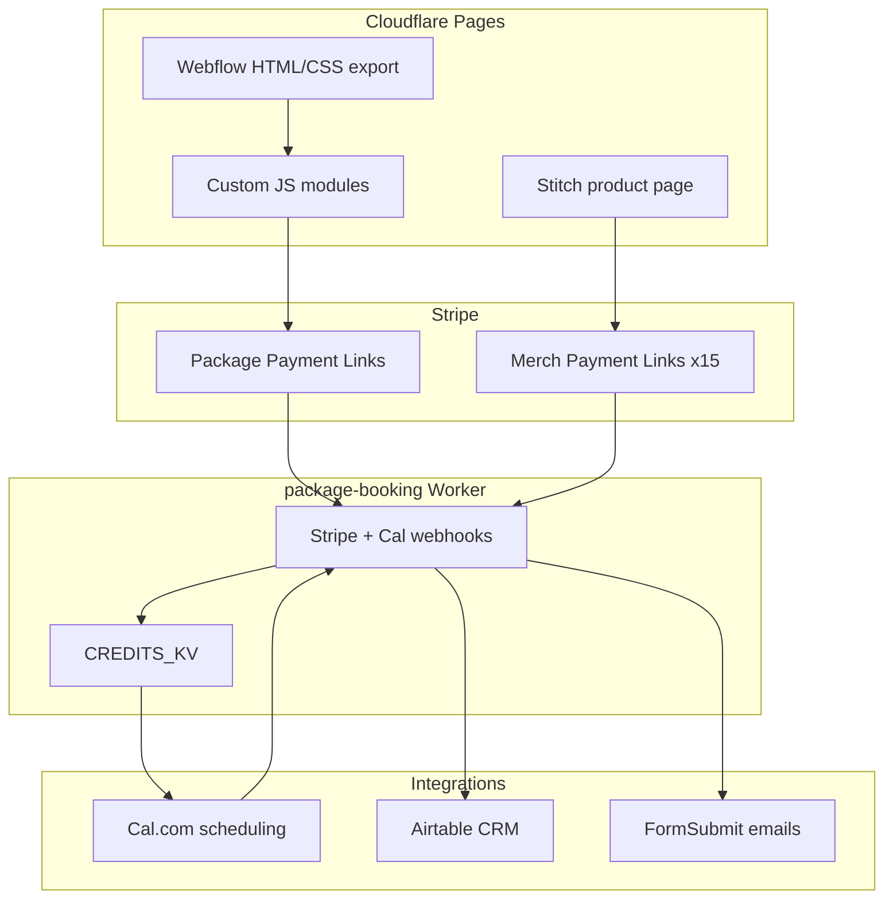

# Built By Me EZ

**Hackensack, NJ personal training — packages, booking, and merch.**

Live site: [builtbymeez.com](https://builtbymeez.com)

Built By Me EZ is a full-stack business platform for personal trainer Omar Ndiaye: sell multi-session training packages, self-serve session booking, capture leads, fulfill merch orders, and sync everything to a CRM—without a traditional backend server.

Developed by [EK Web Development](https://elombekisala.com).

---

## Case Study at a Glance

Omar runs a personalized fitness coaching business in Hackensack, NJ, serving Bergen County and surrounding areas. His website went from a marketing brochure to a **revenue and operations platform**:

| Capability | How it works |
|------------|--------------|
| **Sell packages** | Stripe Payment Links on six package pages ($400–$950) |
| **Book sessions** | Post-purchase portal with token-gated Cal.com embed |
| **Capture leads** | Date picker form saves prospects to Airtable before they pay |
| **Sell merch** | Unified t-shirt storefront — 3 colors × 5 sizes at $35 |
| **Run CRM** | Airtable sync for leads, clients, purchases, sessions, orders |
| **Notify automatically** | FormSubmit emails to Omar on every sale, lead, and order |

---

## Architecture



| Component | URL |
|-----------|-----|
| Website | `https://builtbymeez.com` |
| Worker API | `https://package-booking.elombe.workers.dev` |

---

## Stakeholder Value

| Stakeholder | Primary wins |
|-------------|--------------|
| **Developer** | Static-first stack, one Worker for all server logic, scriptable Stripe maintenance, Stitch → CSS design pipeline |
| **Client (Omar)** | Automated sales + booking, CRM visibility, merch revenue, fewer manual emails |
| **Customers** | Clear package pages, secure Stripe checkout, self-serve booking portal, branded merch with shipping |

---

## Documentation

Full paginated case study documentation lives in [`docs/`](docs/README.md):

| # | Chapter | Topic |
|---|---------|-------|
| 1 | [Brand and Vision](docs/01-brand-and-vision.md) | Brand, owner, market, business transformation |
| 2 | [Architecture Overview](docs/02-architecture-overview.md) | Full-stack map and user journeys |
| 3 | [Frontend and Design](docs/03-frontend-and-design.md) | Webflow, Stitch, CSS/JS patterns |
| 4 | [Training Packages and Booking](docs/04-training-packages-and-booking.md) | Pay-first flow, booking portal, Cal credits |
| 5 | [Merch Ecommerce](docs/05-merch-ecommerce.md) | Payment Links, webhook fulfillment |
| 6 | [Lead Capture and CRM](docs/06-lead-capture-and-crm.md) | Soft leads, Airtable lifecycle |
| 7 | [Backend Worker](docs/07-backend-worker.md) | Endpoints, KV, webhooks, security |
| 8 | [Deployment and Operations](docs/08-deployment-and-operations.md) | Pages, secrets, maintenance |
| 9 | [Stakeholder Impact](docs/09-stakeholder-impact.md) | Case study narrative and KPIs |
| 10 | [Future Roadmap](docs/10-future-roadmap.md) | Gaps, next phases, publication checklist |

**Operator runbook:** [workers/package-booking/README.md](workers/package-booking/README.md)

---

## Tech Stack

| Layer | Technology |
|-------|------------|
| Frontend | Webflow export, custom JavaScript, Stitch-derived product CSS |
| Hosting | Cloudflare Pages |
| Backend | Cloudflare Workers + KV |
| Payments | Stripe Payment Links |
| Scheduling | Cal.com |
| CRM | Airtable |
| Email | FormSubmit |
| Analytics | Google Analytics 4 |

---

## Repository Structure

```
├── index.html                 # Homepage
├── *-session-*.html           # Package and drop-in pages
├── book-sessions.html         # Post-purchase booking portal
├── products/                  # Merch storefront
├── css/                       # Stylesheets
├── js/                        # Custom JavaScript modules
├── workers/package-booking/   # Cloudflare Worker
├── scripts/                   # Stripe link maintenance
├── docs/                      # Case study documentation
└── _headers                   # Cloudflare Pages cache rules
```

---

## Quick Start

### View locally

```bash
git clone https://github.com/SWFTstudios/built_by_me_ez.git
cd built_by_me_ez
npx serve .
```

Open `index.html` or run a local static server. Note: `js/builtbymeez.js` (Webflow interactions) may need re-export from Webflow for full slider/nav behavior.

### Deploy Worker

```bash
cd workers/package-booking
npx wrangler secret put STRIPE_WEBHOOK_SECRET
npx wrangler secret put STRIPE_SECRET_KEY
npx wrangler secret put AIRTABLE_API_KEY
npx wrangler deploy
```

See [Worker Setup Guide](workers/package-booking/README.md) for full configuration.

### Verify merch links

```bash
node scripts/verify-merch-links.mjs
```

---

## Key Flows

**Package purchase:** Package page → Stripe → webhook → booking email → `book-sessions.html?token=` → Cal.com

**Merch purchase:** Product page → Stripe Payment Link → webhook → Airtable + emails → order confirmation

**Lead capture:** Package page date picker → FormSubmit + Airtable Leads

---

## Credits

© 2026 Built By Me EZ. All rights reserved.

Website by [EK Web Development](https://elombekisala.com)
