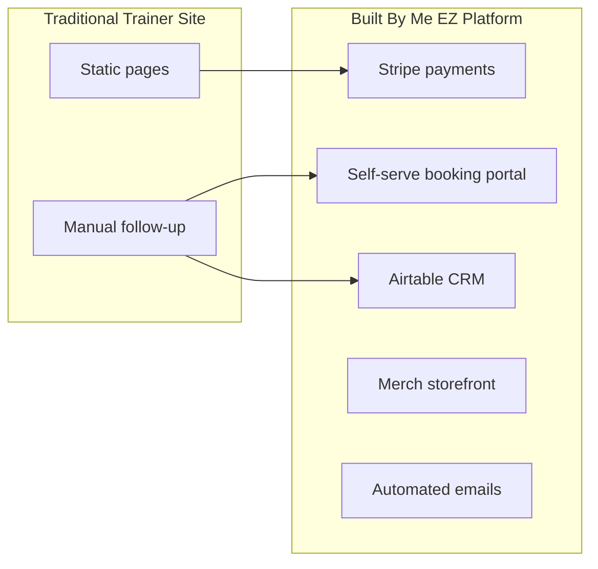

# Chapter 1 — Brand and Vision

**Built By Me EZ** is a personal training brand based in Hackensack, New Jersey, serving clients across Bergen County and surrounding areas. The website at [builtbymeez.com](https://builtbymeez.com) is not a static brochure—it is a **revenue and operations platform** that sells training packages, books sessions, captures leads, fulfills merch orders, and syncs customer data to a CRM.

---

## The Brand

### Positioning

Built By Me EZ delivers personalized fitness coaching for people who want results tailored to their goals—weight loss, muscle building, and overall fitness improvement. The brand message is direct and motivational:

> *Transform Your Body, Transform Your Life.*

Training is positioned as **individualized**, not one-size-fits-all: programs are designed specifically for each client's goals.

### Visual Identity

The site uses a dark athletic aesthetic with a coral-red accent (`#c70303`), high-contrast typography, and photography that emphasizes strength and transformation.

| Element | Value |
|---------|-------|
| Primary accent | `#c70303` (coral / chocolate red) |
| Background | `#050704` (near-black) |
| Body text | `whitesmoke` |
| Display fonts | Oswald, Exo (main site); Anton, Hanken Grotesk (product page) |
| Logo | Muscular figure with barbell — "ME EZ" wordmark |

The merch product page uses a separate **IRON_CORE** design system (red container `#e60000`, dot-grid background) while sharing the same navbar and brand voice.

---

## The Owner

**Omar Ndiaye** runs Built By Me EZ as trainer, operator, and primary point of contact.

| Channel | Detail |
|---------|--------|
| Website | [builtbymeez.com](https://builtbymeez.com) |
| Email | builtbymeez1@gmail.com |
| Phone | +1 (201) 759-8043 |
| Scheduling | Cal.com username `omar-ndiaye-illqmu` |

Omar's Cal.com account powers inline booking on drop-in pages and the post-purchase session portal. Order notifications, package sales alerts, and lead submissions route to his inbox automatically.

---

## Market and Audience

### Geographic focus

- **Primary:** Hackensack, NJ
- **Service area:** Bergen County and surrounding counties (per site meta description)

### Customer segments

1. **Prospects** — browsing, requesting free consultation, or saving ideal training dates before purchase
2. **Package clients** — purchased 8, 12, or 16-session bundles (1:1 or semi-private)
3. **Drop-in clients** — single trial session ($85) or semi-private drop-in ($40)
4. **Merch buyers** — logo t-shirt in black, brown, or blue

---

## Product Catalog

### Training services

| Offering | Price | Booking method |
|----------|-------|----------------|
| Single training session (trial) | $85 | Cal.com inline embed |
| Semi-private drop-in | $40 | Cal.com inline embed |
| 8-Session 1:1 package | $475 | Stripe → booking portal |
| 12-Session 1:1 package | $700 | Stripe → booking portal |
| 16-Session 1:1 package | $950 | Stripe → booking portal |
| 8-Session semi-private | $400 | Stripe → booking portal |
| 12-Session semi-private | $550 | Stripe → booking portal |
| 16-Session semi-private | $700 | Stripe → booking portal |

### Merchandise

| Product | Price | Variants |
|---------|-------|----------|
| Built By Me EZ Logo T-Shirt | $35 | 3 colorways × 5 sizes (XS–XL) |

---

## Business Transformation Thesis

### Before

A typical fitness trainer website might offer:

- A contact form and phone number
- Manual invoicing over text or email
- Cal.com links sent individually after payment
- No merch storefront
- No centralized view of leads, purchases, or bookings

### After (with this platform)

Built By Me EZ now operates as an integrated business system:

**Key shifts:**

1. **Revenue automation** — clients pay online via Stripe; Omar is notified instantly
2. **Booking automation** — purchased packages unlock a token-gated portal; clients book remaining sessions without back-and-forth
3. **Lead nurturing** — prospects can save ideal dates before committing; data lands in Airtable
4. **Merch revenue** — branded apparel sold with shipping collection and order fulfillment emails
5. **Operational visibility** — every sale, booking, lead, and merch order syncs to CRM tables

This transformation is the central narrative for a future case study about how digital infrastructure helps a solo trainer scale beyond hourly manual admin work.

---

## Site Goals (Technical → Business)

| Site capability | Business outcome |
|-----------------|------------------|
| Package pages with Stripe pay links | Sell multi-session bundles 24/7 |
| Booking portal with session credits | Reduce scheduling admin after each sale |
| Lead capture with date picker | Capture warm prospects who aren't ready to pay |
| Merch ecommerce | Additional revenue + brand visibility |
| Airtable CRM sync | Single source of truth for client pipeline |
| Automated emails | Faster response, professional customer experience |

---

## Credits

Website developed by [EK Web Development](https://elombekisala.com).  
© 2026 Built By Me EZ. All rights reserved.

---

**Next:** [Chapter 2 — Architecture Overview →](02-architecture-overview.md)
