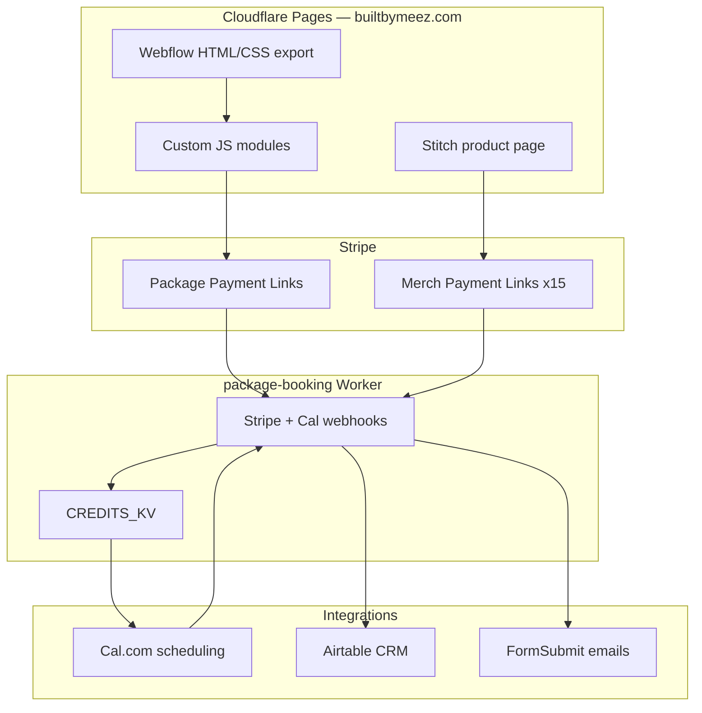

# Chapter 2 — Architecture Overview

This chapter maps how the Built By Me EZ website is structured—from the static frontend on Cloudflare Pages through the Cloudflare Worker that orchestrates payments, booking credits, CRM sync, and email notifications.

---

## Why This Stack

The architecture optimizes for three constraints common to solo fitness businesses:

1. **Design quality** — Webflow provides professional layout, animations, and responsive components without custom framework overhead
2. **Low operating cost** — static hosting on Cloudflare Pages is fast, global, and inexpensive at scale
3. **Stateful logic without a server** — a single Cloudflare Worker handles webhooks, session credits, and CRM writes without managing databases or VPS infrastructure

Third-party services handle specialized domains:

| Concern | Service | Role |
|---------|---------|------|
| Payments | Stripe | Payment Links, checkout sessions, webhooks |
| Scheduling | Cal.com | Inline embeds + booking webhooks |
| CRM | Airtable | Leads, clients, purchases, sessions, merch orders |
| Email | FormSubmit | Transactional notifications (no SMTP setup) |
| Analytics | Google Analytics | Traffic measurement (`G-QWVH0FBHWX`) |

---

## System Diagram



**Worker URL:** `https://package-booking.elombe.workers.dev`

---

## Separation of Concerns

| Layer | Responsibility | Location |
|-------|----------------|----------|
| **Presentation** | HTML structure, styling, client-side UX | Root HTML, `css/`, `js/`, `products/` |
| **Orchestration** | Webhooks, credit tracking, CRM writes, email triggers | `workers/package-booking/index.js` |
| **Money** | Payment collection, receipts, shipping on merch | Stripe Payment Links + Dashboard |
| **Schedule** | Calendar availability, booking events | Cal.com |
| **CRM** | Persistent records, trainer dashboard views | Airtable Personal Trainer Demo CRM |

The frontend never holds secrets. Stripe checkout starts via public Payment Link URLs. The Worker validates Stripe webhook signatures server-side.

---

## User Journey Map

### 1. Free consultation

```
Homepage #FREE-CONSULTATION → FormSubmit.co → Omar's inbox
```

No Worker involvement. Pure client-side form submission.

### 2. Trial / drop-in session

```
Package page or homepage → single-training-session.html → Cal.com embed → booked
```

Cal.com handles payment for per-session offerings configured in Omar's Cal dashboard.

### 3. Multi-session package (pay-first)

```
Package page → Stripe Payment Link (?client_reference_id=slug)
  → Stripe webhook → Worker
  → KV credits + token
  → Email with book-sessions.html?token=
  → Client books via Cal embed
  → Cal webhook → credit decrement + Airtable session row
```

### 4. Soft lead (no payment)

```
Package page #package-lead-capture → date picker + email
  → FormSubmit (admin + customer CC)
  → Worker POST /save-lead → Airtable Leads table
```

### 5. Merch purchase

```
Homepage merch slider → products/built-by-me-ez-logo-t-shirt.html
  → Select color + size + email
  → Redirect to Stripe Payment Link (client_reference_id=logo-tshirt-{color}-{size})
  → Stripe webhook → Worker
  → Airtable Merch Orders + admin + customer emails
  → Redirect to order-confirmation.html
```

### 6. Portal recovery

```
book-sessions.html (no token) → email lookup
  → Worker POST /resend-link → re-email booking URL
```

---

## Repository Structure

```
built_by_me_ez/
├── index.html                    # Homepage
├── *-session-*.html              # Package and drop-in pages
├── book-sessions.html            # Post-purchase booking portal
├── products/
│   ├── built-by-me-ez-logo-t-shirt.html   # Unified merch PDP
│   ├── built-by-me-ez-logo-t-shirt-*.html # Color redirects
│   └── order-confirmation.html
├── css/
│   ├── normalize.css             # Webflow reset
│   ├── components.css            # Webflow component library
│   ├── builtbymeez.css           # Site theme + custom sections
│   └── product-page.css          # Stitch-derived product page
├── js/
│   ├── cal-embed.js              # Cal.com embed loader
│   ├── lead-capture.js           # Date picker + lead form
│   ├── package-sticky-cta.js     # Fixed pay/lead bar
│   ├── merch-payment-links.js    # Stripe link map
│   ├── merch-product.js          # Colorway switcher
│   └── merch-checkout.js         # Payment Link redirect
├── workers/package-booking/      # Cloudflare Worker
├── scripts/                      # Stripe link maintenance
├── reference/stitch-*/           # Design reference (not production)
├── _headers                      # Cloudflare Pages cache rules
└── docs/                         # This documentation
```

---

## Deployment Topology

| Component | Host | Domain |
|-----------|------|--------|
| Static site | Cloudflare Pages | `builtbymeez.com` |
| Worker API | Cloudflare Workers | `package-booking.elombe.workers.dev` |
| Preview deploys | Cloudflare Pages | `*.builtbymeez-website.pages.dev` |

Pages serves HTML/CSS/JS from the repo root. The Worker is deployed separately via Wrangler from `workers/package-booking/`.

---

## Data Flow Principles

1. **Idempotency** — merch orders use KV key `merch-order:{sessionId}` to prevent duplicate CRM rows on webhook retry
2. **Token-gated booking** — session credits are tied to a random token emailed after payment; unpaid users cannot access the booking portal
3. **Graceful degradation** — if Airtable credentials are missing, the Worker logs `[AIRTABLE SKIP]` and continues (emails still send)
4. **Single webhook endpoint** — one Stripe webhook URL handles both training packages and merch; routing uses `client_reference_id` and metadata

---

## Further Reading

- [Chapter 3 — Frontend and Design](03-frontend-and-design.md) — how pages are built and styled
- [Chapter 7 — Backend Worker](07-backend-worker.md) — endpoint reference and KV schema
- [Worker Setup Guide](../workers/package-booking/README.md) — deploy and secrets checklist

---

[← Chapter 1 — Brand and Vision](01-brand-and-vision.md) | [Chapter 3 — Frontend and Design →](03-frontend-and-design.md)
