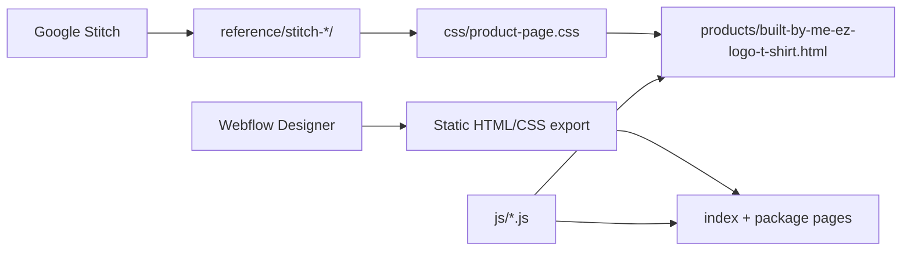

# Chapter 3 — Frontend and Design

The Built By Me EZ frontend combines a **Webflow export** (homepage and package pages) with **custom JavaScript modules** and a **Google Stitch–inspired product page**. This chapter explains the design systems, code techniques, and why each approach benefits maintainability.

---

## Design Pipeline Overview



**Technique:** Design tools produce **specifications**, not runtime dependencies. Stitch output lives in `reference/` as a source of truth; production code uses semantic HTML and hand-authored BEM CSS.

---

## Webflow Export Pattern

The site was last published from Webflow on **July 24, 2025**. Exported pages include Webflow metadata and class conventions:

| Pattern | Purpose |
|---------|---------|
| `data-wf-page`, `data-wf-site` | Webflow page/site identifiers |
| `w-nav`, `w-slider`, `w-tabs`, `w-form` | Component behavior hooks |
| `w-dyn-list`, `w-dyn-empty` | CMS collection placeholders |
| `components.css` | Webflow component library (~1,800 lines) |
| `builtbymeez.css` | Site-specific theme (~3,300 lines) |

### Theme tokens (main site)

```css
/* css/builtbymeez.css — representative variables */
--black: #050704;
--coral / --chocolate: #c70303;
--white-texts: whitesmoke;
--light-salmon: #ff8f4f;
```

**Fonts:** Exo (body), Oswald (headings), Spartan (UI). Accent spans use `.text-span-orange-plain`.

### Webflow interactions bundle

Every page loads `js/builtbymeez.js` — the Webflow interactions bundle (nav menus, sliders, tabs, scroll animations). This file may be absent from the git repo if not re-exported from Webflow; it is required for full local behavior and is deployed with the site on Cloudflare Pages.

---

## Stitch Product Page (IRON_CORE)

The merch product detail page (`products/built-by-me-ez-logo-t-shirt.html`) uses a separate design system derived from Google Stitch project **Built By Me EZ Redesign**.

| Token | Value | Usage |
|-------|-------|-------|
| `--pp-primary-container` | `#e60000` | CTA buttons, accents |
| `--pp-background` | `#131313` | Page background |
| Display font | Anton | Product title |
| Body font | Hanken Grotesk | Descriptions |
| Label font | JetBrains Mono | Size/color labels |

CSS uses BEM naming: `.product-page__main`, `.product-page__size-grid`, `.product-page__color-swatch`.

**Reference files:**

- `reference/stitch-built-by-me-ez-redesign/screens/redesigned-product-page/code.html`
- `reference/stitch-built-by-me-ez-redesign/screens/redesigned-product-page/screen.png`
- `scripts/fetch-stitch-product.mjs` — pulls design assets via Stitch MCP

**Benefit for developer:** Stitch provides pixel-accurate mockups; production CSS is lightweight and framework-free.  
**Benefit for client:** Premium merch storefront matching gym brand without Shopify complexity.  
**Benefit for customers:** Clear size/color selection, accessible labels, mobile-friendly grid.

---

## Custom JavaScript Modules

### `js/cal-embed.js` — Declarative Cal.com embeds

Loads the Cal.com embed SDK once, then initializes every element matching:

```html
<div class="cal-embed-host"
     data-cal-namespace="single-training-session"
     data-cal-link="omar-ndiaye-illqmu/single-training-session">
</div>
```

**Technique:** Data attributes decouple HTML from JavaScript. Changing a Cal event slug requires updating `data-cal-link` only—no JS edits.

**Used on:** `single-training-session.html`, `semi-private-drop-in.html`, `book-sessions.html` (dynamic after token validation).

---

### `js/lead-capture.js` — Dual-month date picker

Powers the "Save My Ideal Dates" section on package pages (`.section-lead-capture`).

**Key behaviors:**

- Renders two side-by-side month calendars
- Limits selectable dates per package slug (8, 12, or 16 max)
- Submits to **FormSubmit** (admin notification + customer CC) and **Worker** `/save-lead` (Airtable only)

```javascript
// js/lead-capture.js — package-scoped date limits
var SLUG_MAX_DATES = {
  '8-session-1-1':  8,
  '12-session-1-1': 12,
  '16-session-1-1': 16,
  '8-session-semi':  8,
  '12-session-semi': 12,
  '16-session-semi': 16,
};
```

**Technique:** Per-page configuration via HTML data attributes (`data-package-slug`, `data-package-label`, `data-stripe-link`) keeps one JS file reusable across six package pages.

---

### `js/package-sticky-cta.js` — Context-aware fixed bar

On `body.package-page`, injects a sticky bottom bar with:

- **Pay Now** — opens Stripe Payment Link (desktop) or scrolls to pay section (mobile)
- **Save My Ideal Dates** — scrolls to lead capture form

Uses `IntersectionObserver` to hide the bar when pay/lead sections are already visible.

**Benefit:** Conversion optimization without modal popups; always-visible CTAs on long package pages.

---

### `js/merch-product.js` — URL-synced colorway state

Manages the unified t-shirt product page:

- Syncs gallery image, subtitle, and radio buttons when color changes
- Updates URL query param: `?color=black|brown|blue`
- Sets `data-merch-color` on `<body>` for checkout script

```javascript
// js/merch-product.js — URL sync on color change
url.searchParams.set('color', slug);
window.history.replaceState({}, '', url.pathname + url.search);
```

**Technique:** Shareable deep links (`?color=blue`) from homepage merch slider land on the correct variant.

---

### `js/merch-payment-links.js` + `js/merch-checkout.js` — Stripe redirect checkout

Payment links are a static config map—one URL per color × size:

```javascript
// js/merch-payment-links.js
window.MERCH_PAYMENT_LINKS = {
  black: { XS: 'https://buy.stripe.com/...', /* ... */ },
  brown: { /* ... */ },
  blue:  { /* ... */ },
};
```

Checkout intercepts the Webflow form submit and redirects:

```javascript
// js/merch-checkout.js — build checkout URL
url.searchParams.set('client_reference_id', 'logo-tshirt-' + color + '-' + size.toLowerCase());
if (email) {
  url.searchParams.set('prefilled_email', email);
}
window.location.href = url.toString();
```

**Technique:** No Worker API call at checkout start—Stripe Payment Links are public URLs. Webhook fulfillment happens server-side after payment.

**Why this matters:** Checkout works even if Worker secrets are misconfigured; only post-payment fulfillment requires the Worker.

---

## Cache Strategy

Static deploys can leave browsers serving stale JavaScript. The site uses two layers:

### 1. Cloudflare Pages `_headers`

```
/js/merch-checkout.js
  Cache-Control: no-cache, must-revalidate
```

Merch scripts use `no-cache` because checkout logic changed significantly during development.

### 2. Query-string cache busting

Product page script tags include version params:

```html
<script src="../js/merch-checkout.js?v=20260605"></script>
```

**Lesson for developers:** When replacing critical client-side logic, assume users have old JS cached. Bust aggressively on payment flows.

---

## Page Types Summary

| Page type | CSS | JS modules |
|-----------|-----|------------|
| Homepage | `builtbymeez.css` | `builtbymeez.js` |
| Package pages | `builtbymeez.css` | `lead-capture.js`, `package-sticky-cta.js`, inline `WORKER_URL` |
| Drop-in / trial | `builtbymeez.css` | `cal-embed.js` |
| Booking portal | `builtbymeez.css` | inline portal logic |
| Merch PDP | `product-page.css` + `builtbymeez.css` | `merch-payment-links.js`, `merch-product.js`, `merch-checkout.js` |

---

## Accessibility Touches

- Product page breadcrumbs with `aria-label`
- Color swatches use `aria-pressed` for active state
- Sticky CTA includes descriptive `aria-label`
- Form errors use `role="alert"` (`#merch-size-error`, `#merch-checkout-error`)
- `book-sessions.html` uses `noindex` meta (portal, not for SEO)

---

## Incomplete CMS Areas

Webflow CMS template stubs exist but are not populated:

- `detail_trainers.html` — trainer profiles
- `detail_post.html` — blog posts
- Homepage trainer/blog sections show `w-dyn-empty` placeholders

Nav links for Trainers and Gallery are hidden (`class="hide"`). See [Chapter 10 — Future Roadmap](10-future-roadmap.md).

---

[← Chapter 2 — Architecture Overview](02-architecture-overview.md) | [Chapter 4 — Training Packages and Booking →](04-training-packages-and-booking.md)
