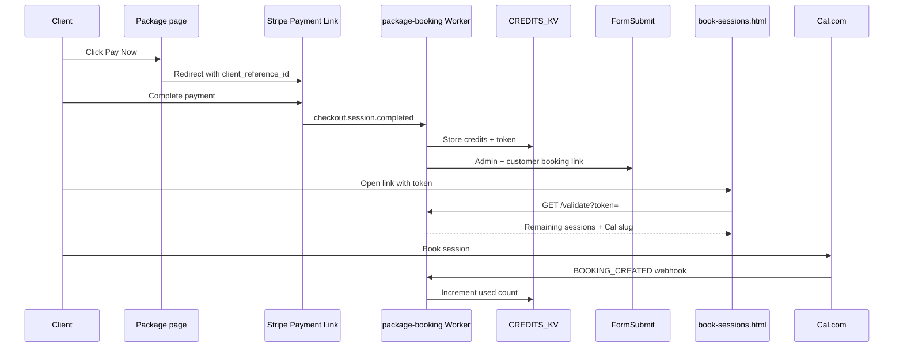

# Chapter 4 — Training Packages and Booking

Multi-session training packages are the core revenue product on Built By Me EZ. This chapter explains the **pay-first booking model**: clients pay via Stripe, receive a private booking link, and self-schedule sessions until their credits are exhausted.

---

## Package Matrix

Six packages span two training formats and three session counts:

| Package | Slug | Sessions | Price | Cal.com event slug |
|---------|------|----------|-------|-------------------|
| 8-Session 1:1 | `8-session-1-1` | 8 | $475 | `8-session-training-package` |
| 12-Session 1:1 | `12-session-1-1` | 12 | $700 | `12-session-1-1-training-package` |
| 16-Session 1:1 | `16-session-1-1` | 16 | $950 | `16-session-package` |
| 8-Session Semi-Private | `8-session-semi` | 8 | $400 | `8-session-semi-private-package` |
| 12-Session Semi-Private | `12-session-semi` | 12 | $550 | `12-session-semi-private-package` |
| 16-Session Semi-Private | `16-session-semi` | 16 | $700 | `16-session-semi-private-package` |

Package definitions live in the Worker:

```javascript
// workers/package-booking/index.js
const PACKAGES = {
  '8-session-1-1':  { sessions: 8,  calSlug: '8-session-training-package',      label: '8-Session 1:1 Training' },
  '12-session-1-1': { sessions: 12, calSlug: '12-session-1-1-training-package', label: '12-Session 1:1 Training' },
  // ...
};
```

---

## Pay-First Flow



### Step 1 — Package page

Each package page (`body.package-page`) includes:

1. **Intro section** — benefits, price, session duration (1 hr 10 min)
2. **`#package-pay`** — 3-step explanation + Stripe Payment Link button
3. **`#package-lead-capture`** — optional date-interest form (see Chapter 6)
4. **Sticky CTA** — `package-sticky-cta.js` fixed bar

Stripe Payment Links append `?client_reference_id={slug}` to identify the package at webhook time.

### Step 2 — Stripe payment

Client pays on Stripe's hosted checkout. Stripe sends `checkout.session.completed` to the Worker webhook.

### Step 3 — Worker provisioning

On successful payment, the Worker:

1. Generates a random booking token
2. Writes KV records:
   - `credits:{email}` → `{ packageSlug, calSlug, label, total, used: 0, token, ... }`
   - `token:{token}` → `{ email }` (1-year TTL)
3. Sends email via FormSubmit to Omar (admin) with customer CC containing booking URL
4. Creates/updates Airtable Package Purchase + Client records

### Step 4 — Booking portal

`book-sessions.html?token=TOKEN` calls `GET /validate?token=` on the Worker.

**On success**, the portal displays:

- Package name and remaining sessions (`total - used`)
- Cal.com inline embed for the correct event type
- Instructions for booking

**On failure** (expired/invalid token), the portal offers email lookup to resend the link.

### Step 5 — Session booking

When the client books on Cal.com, a `BOOKING_CREATED` webhook fires. The Worker:

1. Looks up `credits:{email}` by attendee email
2. Increments `used` if `used < total`
3. Writes a Session Booking row to Airtable
4. Updates the Package Purchase record (sessions used/remaining)

---

## Token-Gated Booking

**Technique:** Session credits are unlocked only after verified payment.

| Without token gating | With token gating |
|---------------------|-------------------|
| Omar manually sends Cal links | Client receives automated link after pay |
| No enforcement of session limits | KV tracks used vs total |
| Risk of unpaid bookings | Portal inaccessible without valid token |

The token is a random string stored in KV with 1-year expiration. It maps to the customer's email for credit lookup.

---

## Resend Link Flow

If a client loses their booking email:

1. Visit `book-sessions.html` without a token
2. Enter the email used at checkout
3. Worker `POST /resend-link` looks up `credits:{email}`
4. Re-sends the booking URL via FormSubmit

**Security:** Returns `{ ok: true }` even when email is not found (prevents account enumeration).

---

## Drop-In Sessions (No Portal)

Single sessions bypass the package credit system:

| Page | Price | Cal link |
|------|-------|----------|
| `single-training-session.html` | $85 | `omar-ndiaye-illqmu/single-training-session` |
| `semi-private-drop-in.html` | $40 | `omar-ndiaye-illqmu/semi-private-drop-in` |

These use `cal-embed.js` for inline booking. Payment is handled by Cal.com directly (configured in Omar's Cal dashboard).

---

## Package Page UX Patterns

### Three-step pay explanation

Package pages guide clients through:

1. **Pay** — secure Stripe checkout
2. **Receive link** — email with booking portal URL
3. **Book sessions** — schedule at your pace until credits run out

### Sticky CTA behavior

| Viewport | Pay Now action |
|----------|----------------|
| Desktop | Opens Stripe Payment Link in new tab |
| Mobile | Scrolls to `#package-pay` section |

The bar hides when pay or lead sections scroll into view (IntersectionObserver).

---

## Edge Cases

### Ambiguous $700 packages

Two packages cost $700 (12-session 1:1 and 16-session semi-private). The Worker resolves package identity via `client_reference_id` on the Payment Link—not amount alone.

```javascript
// Amount fallback excludes $700 — metadata required
const AMOUNT_TO_PACKAGE = {
  47500: '8-session-1-1',
  95000: '16-session-1-1',
  40000: '8-session-semi',
  55000: '12-session-semi',
};
```

### Credit exhaustion

When `used >= total`, the portal still validates but Cal booking should be restricted by business policy. The Worker continues to accept Cal webhooks; Omar can manually handle edge cases via Airtable.

---

## Stakeholder Benefits

| Stakeholder | Benefit |
|-------------|---------|
| **Omar** | Sells packages 24/7; no manual Cal link sending; session usage tracked automatically |
| **Customers** | Pay once, book flexibly; recover lost links via email; clear remaining session count |
| **Developer** | Reusable pattern for any session-based service (coaching, tutoring, consulting) |

---

[← Chapter 3 — Frontend and Design](03-frontend-and-design.md) | [Chapter 5 — Merch Ecommerce →](05-merch-ecommerce.md)
