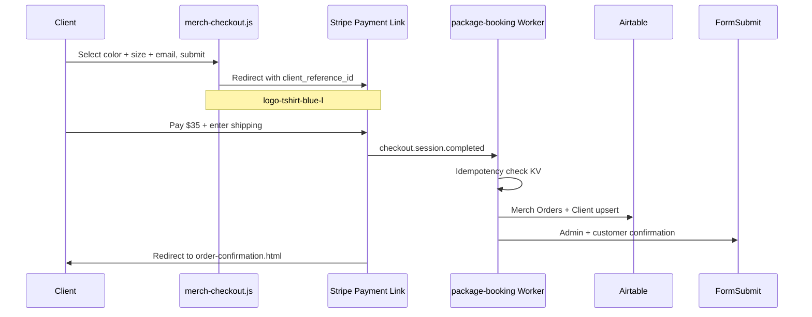

# Chapter 5 — Merch Ecommerce

Built By Me EZ sells branded logo t-shirts through a unified product page with three colorways, five sizes, and Stripe Payment Link checkout at a flat **$35** price. This chapter covers the storefront UX, payment architecture, and automated order fulfillment.

---

## Product Overview

| Attribute | Value |
|-----------|-------|
| Product | Built By Me EZ Logo T-Shirt |
| Price | $35.00 (all variants) |
| Colorways | Black, Brown, Blue |
| Sizes | XS, S, M, L, XL |
| Checkout | Stripe Payment Links (15 total) |
| Shipping | Collected at Stripe checkout (28 countries) |
| Success redirect | `products/order-confirmation.html` |

---

## Unified Product Page

**Canonical URL:** `products/built-by-me-ez-logo-t-shirt.html`

Legacy color-specific URLs redirect with query params:

| Legacy URL | Redirect |
|------------|----------|
| `built-by-me-ez-logo-t-shirt-black.html` | `?color=black` |
| `built-by-me-ez-logo-t-shirt-brown.html` | `?color=brown` |
| `built-by-me-ez-logo-t-shirt-blue.html` | `?color=blue` |

The homepage merch slider links directly with color params:

```
products/built-by-me-ez-logo-t-shirt.html?color=black
products/built-by-me-ez-logo-t-shirt.html?color=brown
products/built-by-me-ez-logo-t-shirt.html?color=blue
```

### Page components

1. **Gallery** — main image + color swatch thumbnails
2. **Colorway picker** — radio buttons synced with swatches
3. **Size grid** — XS through XL (required before checkout)
4. **Email field** — prefilled on Stripe checkout
5. **Checkout button** — redirects to Payment Link

`merch-product.js` syncs gallery, subtitle, URL, and `data-merch-color` when color changes.

---

## Checkout Flow



### Payment Link map

All URLs live in `js/merch-payment-links.js`:

```javascript
window.MERCH_PAYMENT_LINKS = {
  black: {
    XS: 'https://buy.stripe.com/6oU9ATffDbkh7g45PC0480p',
    L:  'https://buy.stripe.com/9B6cN5ebzewt1VKem80480q',
    XL: 'https://buy.stripe.com/00w28r0kJ1JHasg6TG0480t',
    // ...
  },
  brown: { /* 5 sizes */ },
  blue:  { /* 5 sizes */ },
};
```

Each link has a **unique Stripe product name**:

```
Built By Me EZ Logo T-Shirt — Blue / L
```

This makes Omar's Stripe Dashboard and order emails unambiguous.

### Checkout URL parameters

`merch-checkout.js` appends:

| Parameter | Example | Purpose |
|-----------|---------|---------|
| `client_reference_id` | `logo-tshirt-blue-l` | Worker parses color + size |
| `prefilled_email` | `customer@example.com` | Stripe checkout prefill |

```javascript
url.searchParams.set('client_reference_id', 'logo-tshirt-' + color + '-' + size.toLowerCase());
```

---

## Why Payment Links (Not Checkout Sessions API)

The site supports two merch checkout paths:

| Approach | Status | Pros | Cons |
|----------|--------|------|------|
| **Payment Links** | **Primary (production)** | No Worker secret needed at checkout; 15 descriptive products; shipping built-in | 15 links to maintain |
| Checkout Sessions API (`POST /create-merch-checkout`) | Fallback | Dynamic checkout from Worker | Requires valid `STRIPE_SECRET_KEY`; 3 price IDs (size in metadata only) |

**Production uses Payment Links** because:

1. Checkout starts entirely client-side—no server dependency
2. Each variant has a clear title in Stripe
3. Shipping address collection is configured on each link
4. Worker only handles post-payment webhook fulfillment

---

## Webhook Fulfillment

When Stripe sends `checkout.session.completed`, the Worker routes to `handleMerchCheckout()` if:

- `metadata.product_type === 'merch'`, OR
- `client_reference_id` starts with `logo-tshirt-`

### Processing steps

1. **Idempotency** — check KV `merch-order:{sessionId}`; skip if already processed
2. **Parse order data** — name, email, color, size from metadata or `client_reference_id`
3. **Airtable** — create Merch Orders row; upsert Client as "Merch Customer"
4. **Emails** — admin notification to Omar; customer confirmation email
5. **Mark processed** — store idempotency key in KV (1-year TTL)

### Parsed reference format

```
logo-tshirt-{color}-{size}
```

Example: `logo-tshirt-brown-xl` → Brown, XL

---

## Order Confirmation Page

`products/order-confirmation.html` is the Stripe redirect target.

- Reads `?color=` query param for personalized thank-you copy
- Confirms order received; sets expectation for shipping follow-up
- Links back to homepage and merch section

---

## Maintenance Scripts

Located in `scripts/`:

| Script | Purpose |
|--------|---------|
| `setup-merch-stripe-links.mjs` | Create 15 products + Payment Links; output JSON for `merch-payment-links.js` |
| `deactivate-old-merch-links.mjs` | Deactivate legacy duplicate links after refactor |
| `verify-merch-links.mjs` | HEAD-check all 15 URLs return HTTP 200 |

Run verification after any link changes:

```bash
node scripts/verify-merch-links.mjs
```

Requires `STRIPE_SECRET_KEY` for setup/deactivate scripts only—not for verification.

---

## Cache and Deploy Considerations

Merch checkout logic changed significantly during development. The site uses:

- `_headers` with `Cache-Control: no-cache` on merch JS files
- Query-string cache busting: `merch-checkout.js?v=20260605`

**Lesson:** Payment flows are critical paths—always bust cache when checkout logic changes.

---

## Stripe Dashboard Settings

Enable customer receipts for merch buyers:

**Settings → Customer emails → Successful payments** (ON)

The Worker also sends a custom customer confirmation email via FormSubmit.

---

## Stakeholder Benefits

| Stakeholder | Benefit |
|-------------|---------|
| **Omar** | Merch orders arrive by email with color/size; Airtable row for fulfillment; no manual invoicing |
| **Customers** | Choose exact variant; secure Stripe checkout; shipping collected upfront; confirmation email |
| **Developer** | Scriptable link provisioning; verify script for CI; no checkout server to maintain |

---

[← Chapter 4 — Training Packages and Booking](04-training-packages-and-booking.md) | [Chapter 6 — Lead Capture and CRM →](06-lead-capture-and-crm.md)
