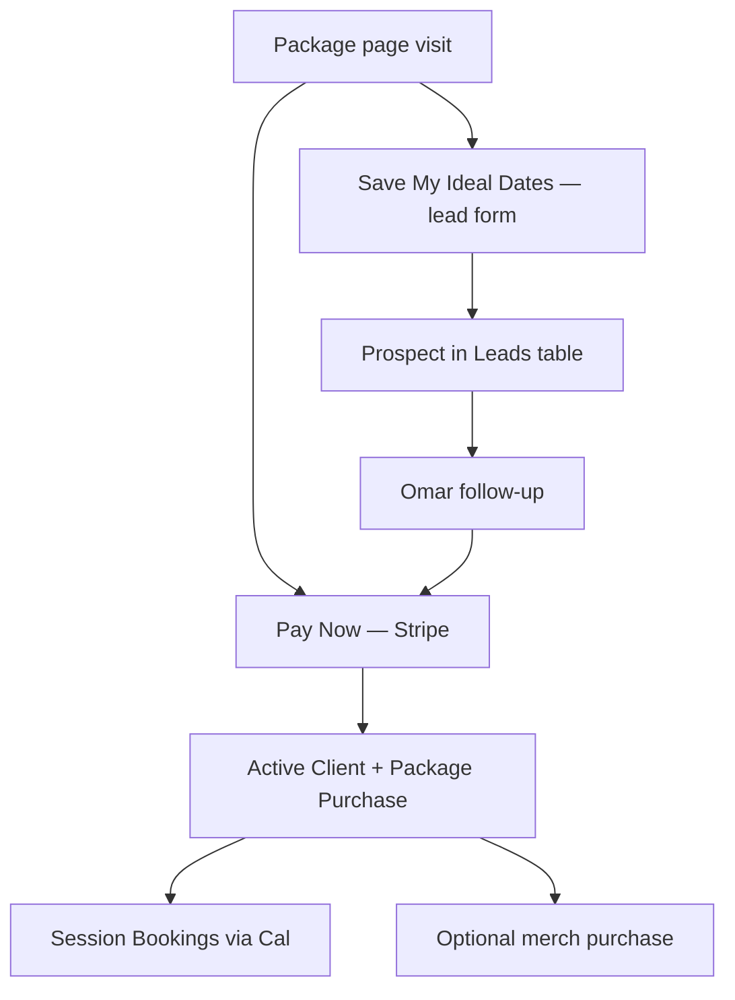
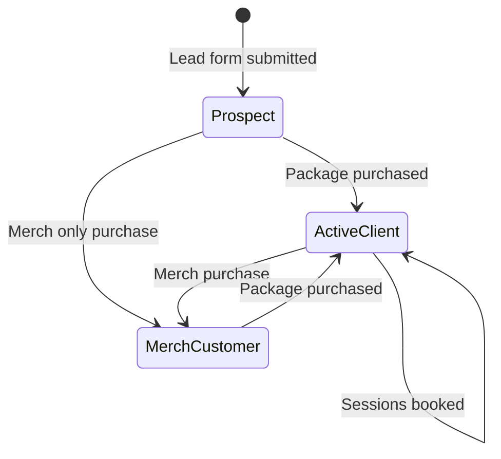

# Chapter 6 — Lead Capture and CRM

Built By Me EZ uses a **two-tier sales funnel**: clients can pay immediately via Stripe, or save their ideal training dates as a soft lead before committing. All customer data syncs to an Airtable CRM, giving Omar a single dashboard for prospects, active clients, purchases, sessions, and merch orders.

---

## Two-Tier Funnel



| Path | Client action | System response |
|------|---------------|-----------------|
| **Hard conversion** | Pay via Stripe | KV credits + booking link + Package Purchase row |
| **Soft conversion** | Submit ideal dates + email | Leads row + FormSubmit notification |

Both paths upsert the **Clients** table so Omar always has a unified contact record.

---

## Lead Capture UI

The lead capture section (`.section-lead-capture`) appears on all six package pages below the pay section.

### Components

1. **Dual-month calendar** — client selects preferred training dates
2. **Date limit** — max selections match package session count (8, 12, or 16)
3. **Email field** — required for follow-up
4. **Submit button** — "Save My Ideal Dates"

### Per-page configuration

HTML data attributes configure each instance:

```html
<section class="section-lead-capture"
         data-package-label="12-Session 1:1 Training"
         data-package-slug="12-session-1-1"
         data-stripe-link="https://buy.stripe.com/...">
```

`lead-capture.js` reads these attributes—one JS file serves all package pages.

### Submission flow

On submit, two parallel actions occur:

1. **FormSubmit** — POST to `formsubmit.co/ajax/builtbymeez1@gmail.com`
   - Admin receives lead notification
   - Customer receives CC copy
   - Subject: `New potential client — {package label}`

2. **Worker** — POST `/save-lead`
   - Writes to Airtable Leads table
   - No email from Worker (FormSubmit handles notifications)

---

## Airtable CRM

**Base:** Personal Trainer Demo CRM  
**Base ID:** `appnv92ohZuf9hmSL`

### Tables

| Table | ID | Written by | Purpose |
|-------|-----|------------|---------|
| **Leads** | `tbluTQ38LPRru9Pxx` | `/save-lead` | Website prospects with ideal dates |
| **Clients** | `tbllorzeIP6XnBrjF` | All flows | Unified contact hub |
| **Package Purchases** | `tblWVjmTXCjPe0smR` | Stripe training webhook | Paid packages + session credits |
| **Session Bookings** | `tblaac1fAf4f61cQs` | Cal webhook | Individual booked sessions |
| **Merch Orders** | `tbl7w4Trf30AmWYzW` | Merch Stripe webhook | T-shirt orders |

### Key fields by table

**Leads**

- Name, Email, Status (`Interested`)
- Package Interest, Package Slug
- Ideal Dates (formatted list)
- Lead Source (`Website`), Submitted At
- Stripe Link (for quick conversion)

**Clients**

- Full Name, Email
- Stage (see lifecycle below)
- Source, Last Activity, Notes, First Contact

**Package Purchases**

- Purchase title, Client Email
- Package Name/Slug, Session Type
- Total/Used/Remaining Sessions
- Amount Paid, Paid Date, Stripe Session ID
- Booking Token/URL, Status (`Active` / `Completed`)

**Session Bookings**

- Session title, Client Email, Package Name
- Session Date/Time, Cal Booking UID
- Status (`Scheduled`)

**Merch Orders**

- Order title, Customer Name, Email
- Product, Color, Size, Amount
- Status (`Paid`), Stripe Session ID, Order Date

---

## Client Lifecycle Stages



| Stage | Trigger | Airtable stage value |
|-------|---------|---------------------|
| Prospect | Lead capture form | `Prospect` or lead Status `Interested` |
| Active Client | Package purchase or session booking | `Active Client` |
| Merch Customer | T-shirt order | `Merch Customer` |

Stages can overlap—a client who buys merch and training appears in both Merch Orders and Package Purchases with a unified Clients record.

---

## Suggested Trainer Dashboard Views

Configure these in Airtable Interfaces for Omar's daily workflow:

| View | Table | Filter |
|------|-------|--------|
| **Prospects** | Leads | Status = Interested or Follow Up |
| **Active Clients** | Clients | Stage = Active Client |
| **Packages and Credits** | Package Purchases | Group by Status, sort by Paid Date |
| **Upcoming Sessions** | Session Bookings | Status = Scheduled |
| **Merch Fulfillment** | Merch Orders | Status = Paid |

---

## CRM Integration Architecture

The Worker uses helper functions for all Airtable writes:

- `airtablePost()` — create record
- `airtablePatch()` — update record
- `airtableFindByEmail()` — lookup existing client
- `airtableFindActivePurchase()` — find active package by email

**Graceful degradation:** If `AIRTABLE_API_KEY` is not set, the Worker logs `[AIRTABLE SKIP]` and continues. Emails and KV credits still work—only CRM sync is skipped.

### Authentication

Create a personal access token at [airtable.com/create/tokens](https://airtable.com/create/tokens) with read/write access to Personal Trainer Demo CRM.

Set via Wrangler:

```bash
npx wrangler secret put AIRTABLE_API_KEY
```

---

## Homepage Contact Form

The free consultation form on `index.html` (`#FREE-CONSULTATION`) uses FormSubmit directly—no Worker or Airtable integration.

Fields: name, phone, email, fitness goal.

This captures top-of-funnel inquiries separately from package-specific leads.

---

## Why Airtable Instead of Custom Admin

| Custom admin panel | Airtable CRM |
|-------------------|--------------|
| Weeks of development | Configure views in hours |
| Hosting + auth maintenance | Managed SaaS |
| Trainer-unfriendly UI | Spreadsheet-familiar interface |
| Locked to one project | Reusable across clients |

**Developer benefit:** Write-to-CRM via REST API; no admin UI to build.  
**Client benefit:** Omar manages pipeline without learning new software beyond Airtable.  
**Customer benefit:** Faster follow-up because leads are organized, not lost in inbox threads.

---

## Data Privacy Notes

- Email addresses are the primary key for client lookup
- Resend-link endpoint does not reveal whether an email exists in the system
- Airtable access is scoped via personal access token permissions
- No payment card data touches the Worker or Airtable (Stripe handles PCI)

---

[← Chapter 5 — Merch Ecommerce](05-merch-ecommerce.md) | [Chapter 7 — Backend Worker →](07-backend-worker.md)
