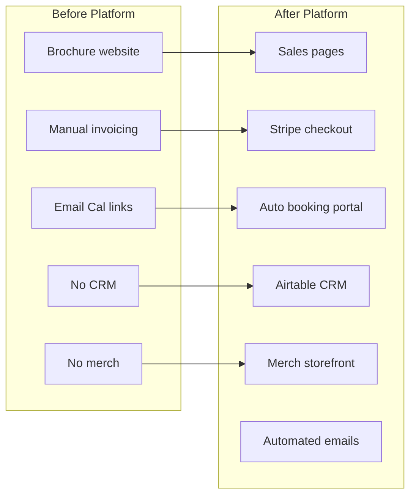

# Chapter 9 — Stakeholder Impact

This chapter is the **case study core**—how Built By Me EZ's digital platform creates value for three audiences: the developer who built it, the business owner who runs it, and the customers who use it.

---

## Overview

Built By Me EZ transformed from a marketing website into an **integrated business system**. The table below summarizes primary wins by stakeholder:

| Stakeholder | Primary wins |
|-------------|--------------|
| **Developer (EK Web Development)** | Reusable architecture, low ops burden, design-to-code pipeline, scriptable maintenance |
| **Client (Omar / Built By Me EZ)** | Automated revenue, reduced admin, CRM visibility, brand extension via merch |
| **Customers** | Transparent pricing, secure checkout, self-serve booking, professional experience |

---

## The Developer Perspective

**EK Web Development** ([elombekisala.com](https://elombekisala.com)) designed and implemented the platform using patterns reusable across fitness, coaching, and service businesses.

### Before: typical project scope

- Export Webflow site
- Embed Cal.com link
- Contact form to email
- Manual everything else

### After: full-stack service delivery

- Webflow + custom JS frontend
- Cloudflare Worker backend
- Stripe payment infrastructure
- Airtable CRM integration
- Automated email workflows
- Ecommerce with 15-variant product matrix

### Technical wins

| Pattern | Reusability |
|---------|-------------|
| Pay-first + token-gated booking portal | Any session-based service (training, tutoring, therapy) |
| Cal.com webhook credit decrement | Package businesses with defined session counts |
| Stripe Payment Link matrix | Physical products with variant combinations |
| Airtable write-through CRM | Clients who need dashboards without custom admin |
| FormSubmit transactional email | Zero SMTP infrastructure |
| Stitch → BEM CSS pipeline | Premium product pages without Shopify |

### Operational wins

- **No database server** — KV for ephemeral state, Airtable for persistent records
- **Single Worker** — one deploy artifact for all server logic
- **Static hosting** — Cloudflare Pages scales automatically; no app server costs
- **Scriptable Stripe** — `setup-merch-stripe-links.mjs` provisions 15 links in one command
- **AI-assisted design** — Google Stitch mockups translated to production CSS

### Business wins for the developer

- Demonstrable case study for fitness vertical
- Maintainable codebase with clear separation of concerns
- Documentation (this series) reduces handoff friction
- Preview deploys on every PR for client review

---

## The Client Perspective (Omar / Built By Me EZ)

Omar Ndiaye operates a personal training business in Hackensack, NJ. The platform addresses pain points common to solo fitness entrepreneurs.

### Before: manual operations

| Task | Old approach |
|------|--------------|
| Sell packages | Text/email invoice; chase payment |
| Send booking links | Manually copy Cal.com URL after each sale |
| Track sessions | Memory, spreadsheet, or honor system |
| Capture leads | Inbox chaos; no structured follow-up |
| Sell merch | Not available online |
| View customer history | Scattered across email threads |

### After: automated operations

| Task | New approach |
|------|--------------|
| Sell packages | Stripe Payment Link on package page; 24/7 |
| Send booking links | Automatic email with portal URL after payment |
| Track sessions | KV credits + Airtable Package Purchases |
| Capture leads | Date picker form → Airtable Leads + email alert |
| Sell merch | Unified storefront; order emails with color/size |
| View customer history | Airtable CRM with lifecycle stages |

### Revenue impact

**New revenue streams:**

1. **Package sales** — six price points from $400 to $950
2. **Merch sales** — $35 t-shirts with automated fulfillment notifications
3. **Reduced leakage** — prospects who aren't ready to pay still enter CRM via lead capture

**Time savings:**

- No manual Cal link sending after each package sale
- No manual order emails for merch (Worker sends admin + customer)
- Structured lead queue instead of inbox archaeology

### Brand impact

- Professional package pages with sticky CTAs and clear pricing
- Premium merch storefront (Stitch-designed) extending brand beyond the gym
- Consistent "Built By Me EZ" experience from homepage to checkout to confirmation

### Omar's daily workflow (ideal state)

1. Check Airtable **Prospects** view for new leads with ideal dates
2. Follow up via phone/email; send Stripe link when ready
3. Receive automatic notification when package sells
4. Receive automatic notification when merch order completes
5. Fulfill merch orders from **Merch Fulfillment** view
6. Monitor **Upcoming Sessions** as clients self-book

---

## The Customer Perspective

Customers interact with Built By Me EZ at multiple touchpoints. Each is designed for clarity, trust, and convenience.

### Discovery and consultation

- Homepage explains philosophy and social proof (reviews slider)
- Free consultation form lowers barrier to first contact
- Clear navigation to packages, classes, and merch

### Package purchase

| Customer need | How the site delivers |
|---------------|----------------------|
| Understand what's included | Package page intro with session count, duration, benefits |
| Know the price upfront | Price displayed prominently; same on Stripe checkout |
| Pay securely | Stripe hosted checkout (PCI compliant) |
| Book without waiting | Immediate email with booking portal link |
| Schedule flexibly | Book sessions at own pace until credits exhausted |
| Recover lost link | Email lookup on booking portal |

### Merch purchase

| Customer need | How the site delivers |
|---------------|----------------------|
| See the product | Gallery with color swatches |
| Choose variant | Color + size selection with validation |
| Fast checkout | Redirect to Stripe; no account required |
| Shipping | Address collected at Stripe checkout |
| Confirmation | Customer email + Stripe receipt |
| Order tracking expectation | Confirmation page sets shipping follow-up expectation |

### Trust signals

- Secure checkout powered by Stripe (noted on product page)
- Professional design consistent with gym brand
- Direct contact info (phone, email) on package pages
- Transparent pricing with no hidden fees

---

## Before / After Comparison

---

## Suggested KPIs for Case Study Measurement

Track these metrics over 90 days post-launch to quantify business transformation:

| KPI | What it measures | Target direction |
|-----|------------------|------------------|
| Package page → Stripe conversion | Sales funnel effectiveness | Increase |
| Lead form submissions | Pipeline volume | Increase |
| Lead → purchase conversion | Follow-up effectiveness | Increase |
| Sessions booked per package | Portal adoption | Increase (toward 100% of credits) |
| Merch orders by colorway | Product-market fit | Identify bestseller |
| Admin time per sale | Operational efficiency | Decrease |
| Customer booking link resends | Email deliverability / UX | Decrease |
| Average response time to leads | Service quality | Decrease |

---

## Case Study Narrative (Draft)

> **Built By Me EZ: From Brochure to Business Platform**
>
> Omar Ndiaye built his reputation as a personal trainer in Hackensack, NJ—but his website only told his story. It couldn't sell packages, book sessions, or capture leads while he was training clients.
>
> EK Web Development transformed builtbymeez.com into an integrated platform: Stripe handles payments, a Cloudflare Worker orchestrates booking credits and CRM sync, Cal.com powers scheduling, and Airtable gives Omar a dashboard he actually uses.
>
> Clients now pay online, receive an instant booking link, and schedule sessions at their own pace. Prospects who aren't ready to commit can save their ideal training dates. Fans of the brand buy logo t-shirts with size and color choice—orders arrive in Omar's inbox with fulfillment details.
>
> The result: less time on admin, more time training—and a business infrastructure that scales with Omar's growth.

---

## Cross-Stakeholder Value Matrix

| Feature | Developer | Omar | Customer |
|---------|-----------|------|----------|
| Package pages + Stripe | Reusable template | 24/7 sales | Clear pricing, secure pay |
| Booking portal | Token-gate pattern | No manual Cal links | Self-serve scheduling |
| Lead capture | Dual-submit pattern | Pipeline visibility | Low-commitment interest |
| Merch ecommerce | Scriptable links | Brand revenue | Variant choice, shipping |
| Airtable CRM | No custom admin | Single dashboard | Faster follow-up |
| Automated emails | FormSubmit integration | Instant notifications | Professional confirmations |
| Cloudflare stack | Low ops, fast deploy | Reliable uptime | Fast page loads |

---

[← Chapter 8 — Deployment and Operations](08-deployment-and-operations.md) | [Chapter 10 — Future Roadmap →](10-future-roadmap.md)
